# BOOKIFY

**A Flutter project that helps you search for books, add them to your library and track your reading time.**

## 🎨 Design

The design was created with [Figma](https://www.figma.com/file/EGg9eFK0Hi8LaVQcPVnjrX/Bookify-Edoardo?node-id=0%3A1)

## ✨ Features

**⚠️ APPLICATION STILL UNDER DEVELOPMENT. More features will be added in the future.**

### 📙 Search Books

This page you can search for books by title, author, category, publisher, and ISBN.
Tapping the book icon, you can choose the type of search you can do: Title, Author, Genre, Publisher, and ISBN.

Tapping on a book will open another page where it specifies the book detailing its characteristics.

Tapping on the **Plus** icon will open the page to scan the ISBN. Yes you will have to give permission to be able to use the device camera. If for any reason the camera cannot find the code, you can click in the **write manually** button and you can write the code manually.

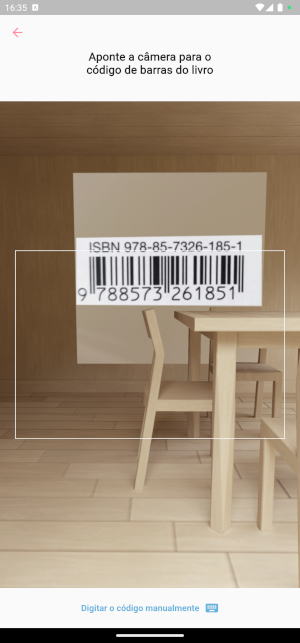
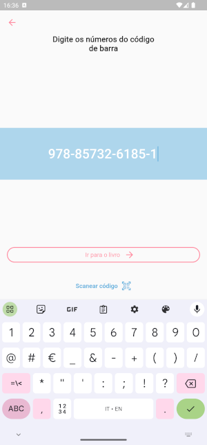

### 🗄️ Bookcase

Clicking on **Bookcases**, you will be redirected to the page for viewing your bookcasase. When you don't have any, you can add them by clicking on the **+ Add a new shelf button**.

On this page you can add your Bookcase information.

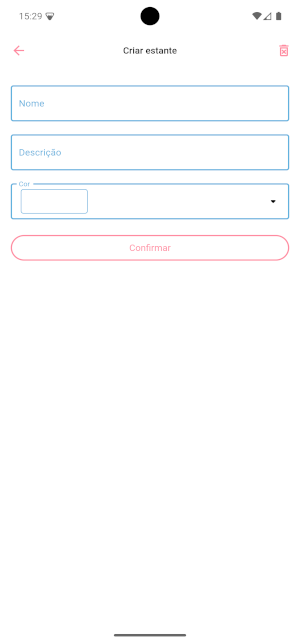
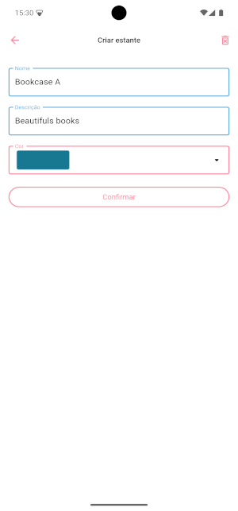

When you finish creating the bookcase, you will return to the previous page with the new bookcase ready for use.

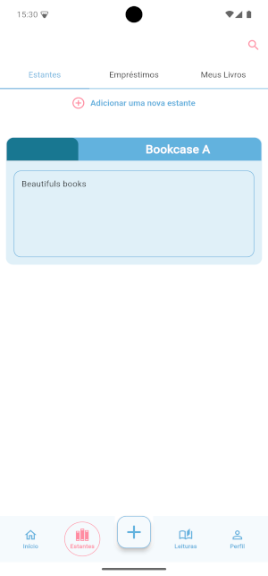

You then place the books you saved earlier on the bookcase, to be able to sort them for future uses.

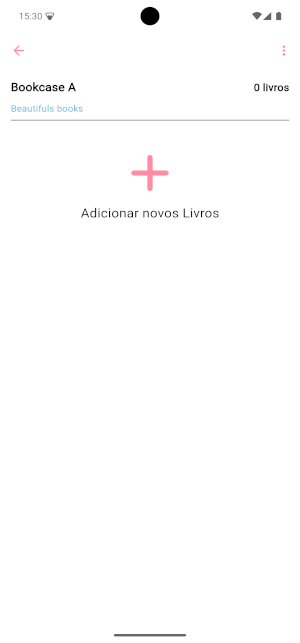
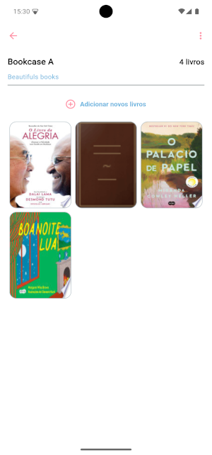

### 📚 My Books

To find out which books you have saved before you can go to the **My Books** section to see your book collection.

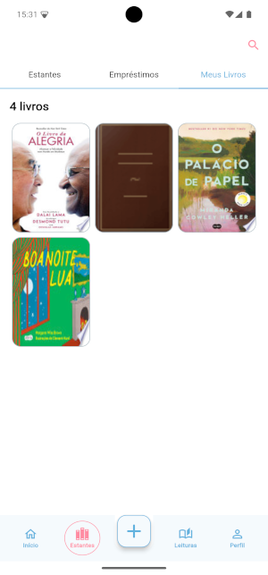

### 🤝 Loans

Now that your shelves are ready, you can lend your books to your friends, family, etc. To start a loan, go to the **loans** section and click on the **+ Add new loan** button.

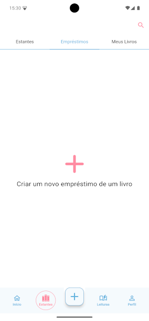

As with the **bookcase**, you can enter your **loan** information, adding the book from your shelf or separate along with the contact who should receive the book.

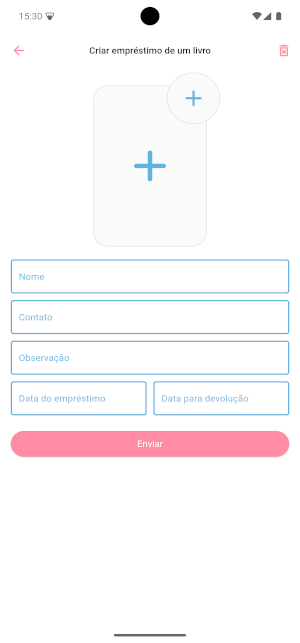
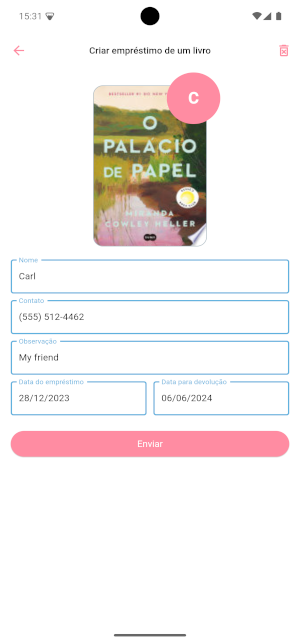

Once entered, you can see the **loan** information by clicking on it.

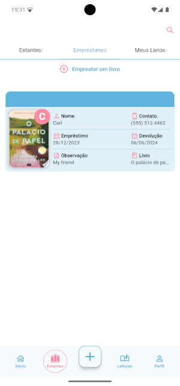
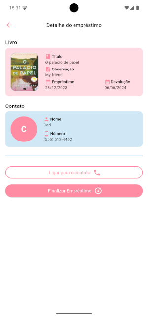

### 📖 Readings

To start a reading, click on the **readings** button, then click on the **+ Add new Reading** button. Once clicked, a bottom sheet menu will appear where you can choose the book.
**Note:** A particular book will be readable if it is not on loan. Just like a book on loan cannot be read.

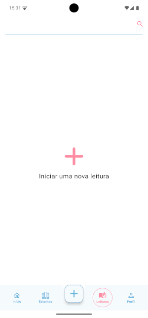

Once you have selected the book, you will be able to read it. To do this, you will need to click on the **Continue Reading** button and you will be redirected to the timer page where you can start reading. When you are finished, you will need to update your reading by moving the sidebar cursor to the pages you have read and then clicking on **Update Reading**.

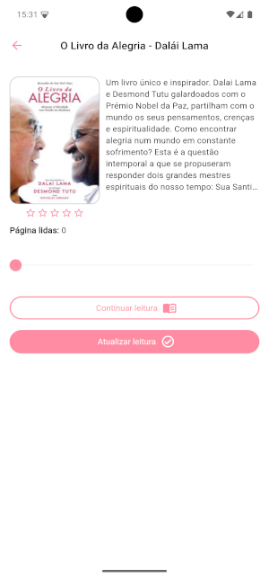
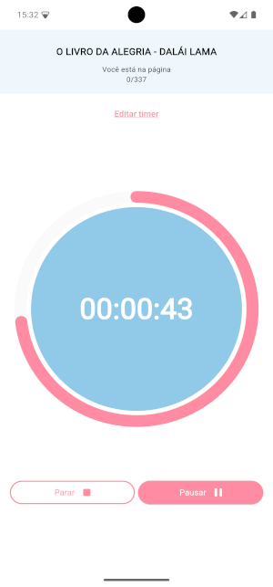
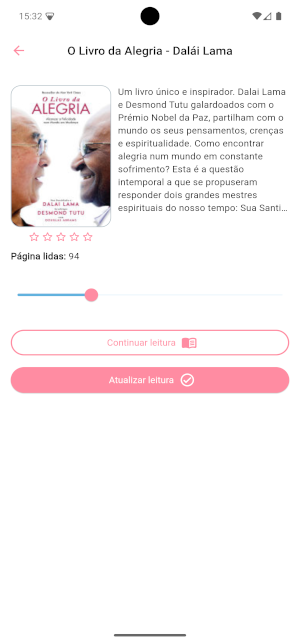

### ⚙️ Settings

Nella pagina **settings** potrai cambiare il tema, aggiornare il tempo di lettura per pagina e l'ora di lettura.

    1. Change Theme: Questa opzione ti farà cambiare il tema in chiaro, scuro e di sistema.

    2. Reading Time: Questa opzione ti farà leggere un testo dove sarà calcolata una media di tempo per poter concludere un libro.

    3. Hour Time: Questa opzione ti farà scegliere l'orario e quando si dovrebbe ripetere per poi notificarti a quell'ora e il tempo scelto sarà usato come default nel timer di lettura.

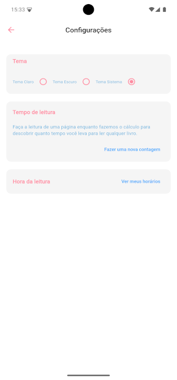

#### Reading Time

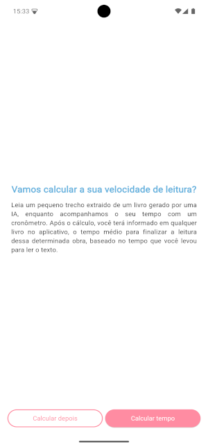
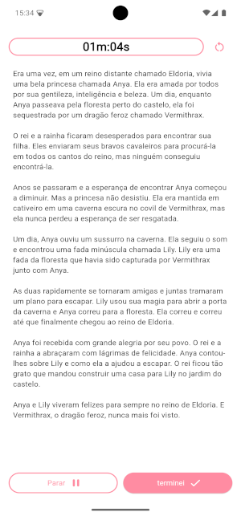

#### Hour Time

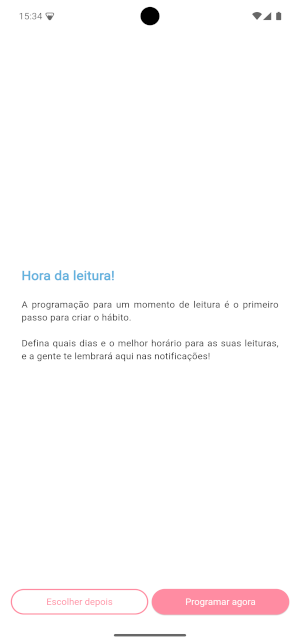
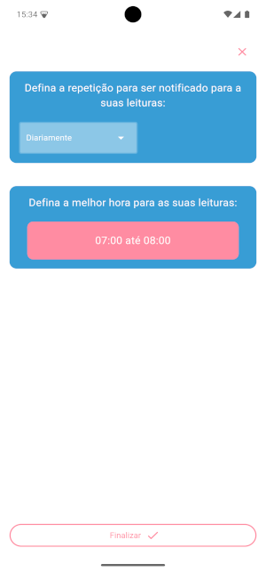
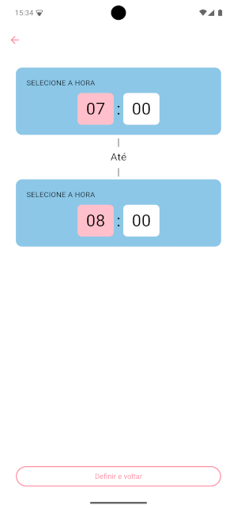

## 👥 Team

1. [Fredson - Designer](https://www.linkedin.com/in/fredsoncosta/)
2. [Edoardo - Developer](https://www.linkedin.com/in/edoardofabrizio/)
