# BOOKIFY

**Bookify** is a cross-platform mobile application developed with Flutter, designed to help users organize their personal library, track reading progress, and manage book loans through a scalable, clean, and pragmatically designed architecture.

---

## 🎨 Design

The user interface design was fully crafted on [Figma](https://www.figma.com/file/EGg9eFK0Hi8LaVQcPVnjrX/Bookify-Edoardo?node-id=0%3A1).

---

## 🚀 Getting Started & Releases

If you just want to try out the app without compiling the source code, you can download the latest pre-compiled binaries directly from the **[Releases](https://github.com/EdoTXp/bookify/releases)** section of this repository. Alternatively, if you want to compile and run Bookify locally from the source code, please note that it requires specific configuration steps, environment keys, and toolchains due to the integration with external services (Firebase, Google Books API, Facebook Auth). You can find our comprehensive step-by-step setup instructions inside our dedicated guide:  
➔ 🔨 **[BUILD.md](BUILD.md)**

---

## 🛠️ Architecture Overview

The project is built upon a **Pragmatic Clean Architecture** layout to ensure high decoupling, testability, and clear separation of concerns.

The application layer flow follows a unidirectional pipeline:  
**View ➔ BLoC ➔ Service ➔ Repository**.

For a comprehensive breakdown of our directory layout, architectural decisions, and model definitions, check out our official design document:
➔ 📐 **[ARCHITECTURE.md](ARCHITECTURE.md)**.

---

## ✨ Core Features

- **📙 Book Search**: Search for books by title, author, category, publisher, and ISBN via Google Books API. Includes camera barcode scanning and manual entry.
- **🗄️ Custom Bookshelves**: Create and manage virtual shelves with custom names and colors to easily organize and categorize your offline collection.
- **📚 My Books**: A dedicated, unified space to view your entire collection of saved books at a single glance.
- **🤝 Loans**: Complete management of books loaned to contacts. Track loan dates, expected return dates, and contact information.
- **📖 Readings & Timer**: Track active reading progress with an integrated session timer and a manual page-count updater.
- **⚙️ Settings**: Customize app behavior: theme management (Light/Dark/System), reading speed calibration, and daily reminders.

### 📸 Interface Gallery

#### 🤖 Android

|                                                        |                                                        |                                                        |                                                        |
| :----------------------------------------------------: | :----------------------------------------------------: | :----------------------------------------------------: | :----------------------------------------------------: |
|    |    |  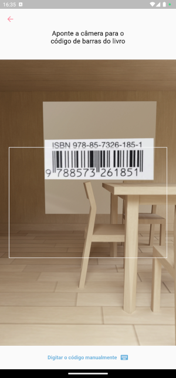  |    |
|  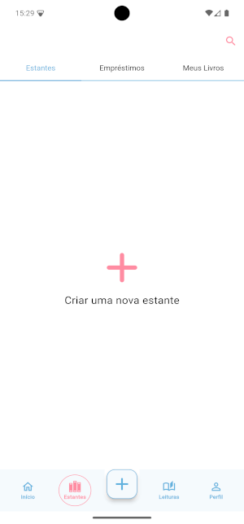  |  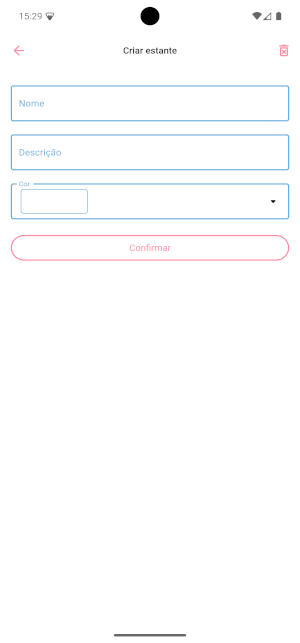  |  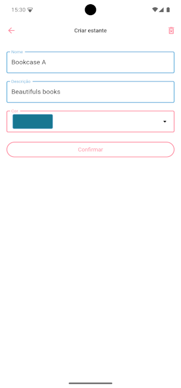  |  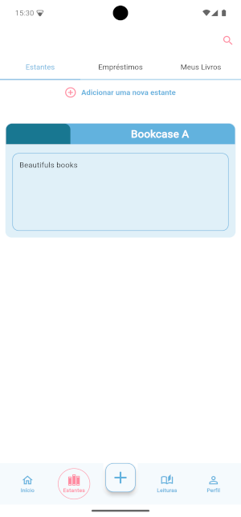  |
|    | 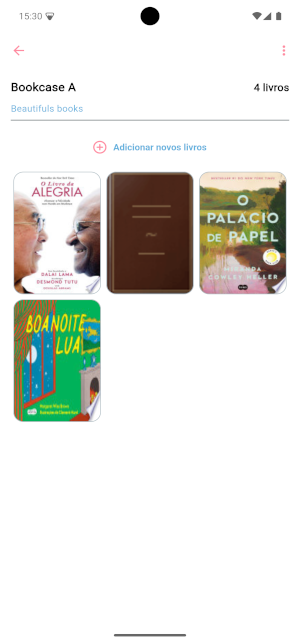 | 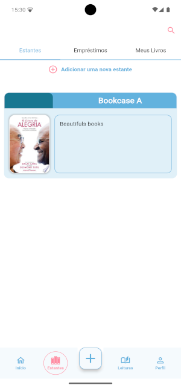 | 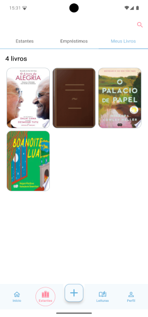 |
| 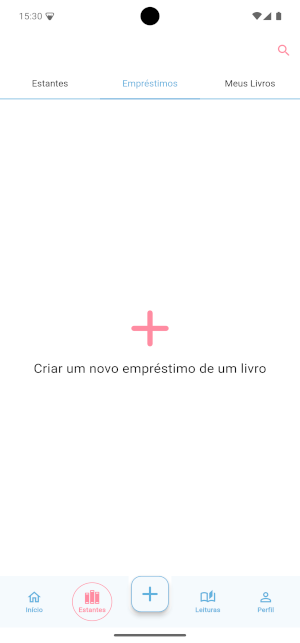 | 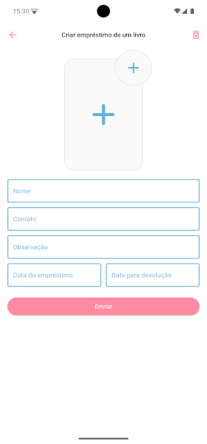 | 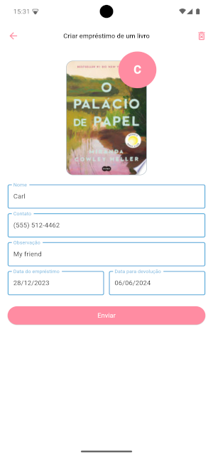 | 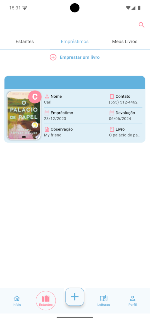 |
| 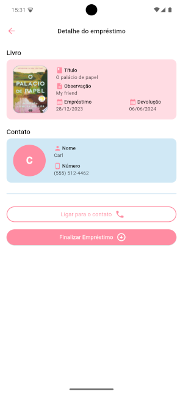 | 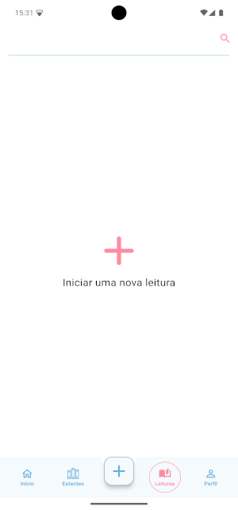 |  | 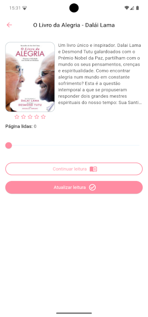 |
| 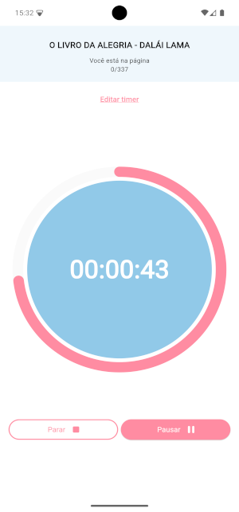 | 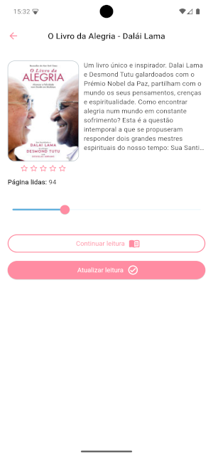 | 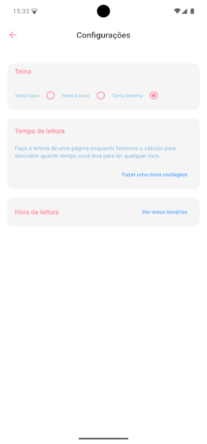 | 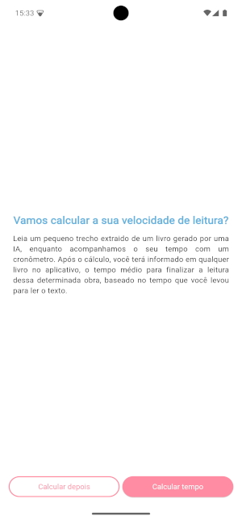 |
|  | 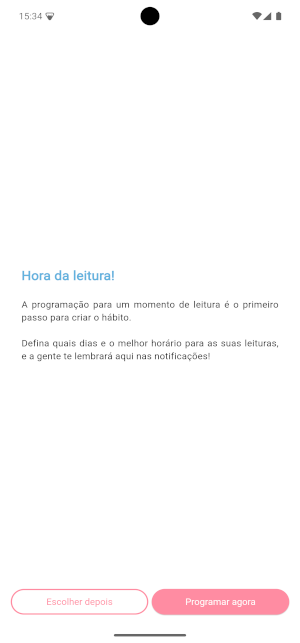 | 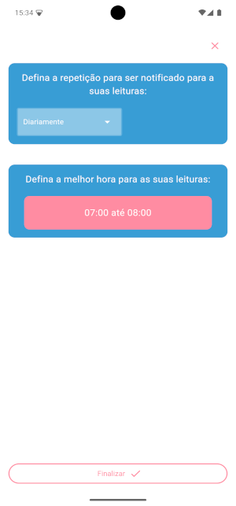 | 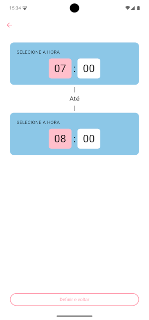 |

#### 🍎 iOS

[iOS Screenshots](docs/design/images/ios/)

---

## 👥 Team & Credits

- **Fredson Costa** - _UI/UX Designer_ - [LinkedIn](https://www.linkedin.com/in/fredsoncosta/)
- **Edoardo Fabrizio De Iovanna** - _Developer_ - [LinkedIn](https://www.linkedin.com/in/edoardofabrizio/) / [Portfolio](https://edotxp.github.io/)
